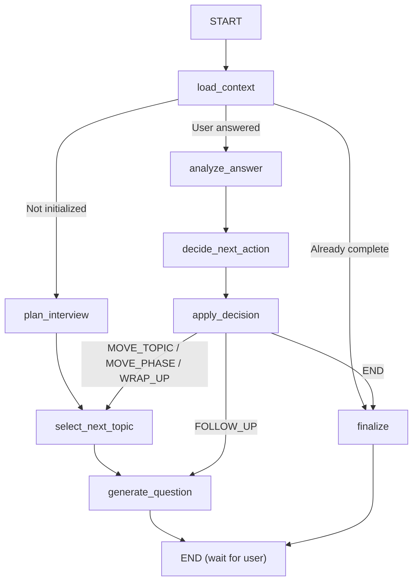

# Devsko AI Interview Backend — Complete Overview

## What This Application Does

This is an **AI-powered technical interview platform** built with **FastAPI** and **LangGraph**. It conducts automated technical interviews with candidates, analyzing their responses in real-time, adapting follow-up questions dynamically, and generating a structured evaluation report at the end.

---

## High-Level Architecture

```
┌─────────────────────────────────────────────────────────┐
│                     FRONTEND (Client)                    │
│   (React/Next.js — sends HTTP + WebSocket requests)      │
└───────────────┬─────────────────────┬───────────────────┘
                │ REST API            │ Socket.IO
                ▼                     ▼
┌───────────────────────────────────────────────────────────┐
│                        main.py                            │
│            FastAPI + Socket.IO ASGI Server                │
│                                                           │
│  ┌──────────────┐    ┌──────────────────────────────┐     │
│  │  REST Routes  │    │  Socket.IO Event Handlers   │     │
│  │ /api/v2/*     │    │  join_interview              │     │
│  │ /api/*        │    │  user_answer                 │     │
│  └──────┬───────┘    │  discovery_start              │     │
│         │            │  terminate_interview           │     │
│         │            └──────────┬───────────────────┘     │
│         └──────────┬───────────┘                          │
│                    ▼                                      │
│   ┌────────────────────────────────┐                      │
│   │     SERVICE LAYER              │                      │
│   │  InterviewService              │                      │
│   │  AIService                     │                      │
│   │  ContextAssemblyService        │                      │
│   │  ResumeService                 │                      │
│   └──────────┬─────────────────────┘                      │
│              ▼                                            │
│   ┌──────────────────────────────────┐                    │
│   │     CORE / AI ENGINE (LangGraph) │                    │
│   │  InterviewState (TypedDict)      │                    │
│   │  StateGraph with 8 Nodes         │                    │
│   │  3 LLM Chains (Ollama/OpenAI)    │                    │
│   │  Agent Skills + Tools            │                    │
│   └──────────┬───────────────────────┘                    │
│              ▼                                            │
│   ┌──────────────────────────────────┐                    │
│   │     REPOSITORY LAYER             │                    │
│   │  SessionRepository               │                    │
│   │  JDRepository                    │                    │
│   │  DevskoInterviewRepository       │                    │
│   └──────────┬───────────────────────┘                    │
│              ▼                                            │
│   ┌──────────────────────────────────┐                    │
│   │     DATABASE LAYER               │                    │
│   │  PostgreSQL (interview DB)       │                    │
│   │  PostgreSQL (devsko DB)          │                    │
│   │  SQLite (fallback/checkpoints)   │                    │
│   └──────────────────────────────────┘                    │
│                                                           │
│   ┌──────────────────────────────────┐                    │
│   │     EXTERNAL SERVICES            │                    │
│   │  Ollama LLM (llama3)             │                    │
│   │  Redis (optional caching)        │                    │
│   └──────────────────────────────────┘                    │
└───────────────────────────────────────────────────────────┘
```

---

## End-to-End Flow: How an Interview Works

### Phase 1: Session Creation
1. **Client** calls `POST /api/v2/ai/assessment/session` with `userid`, `assessmentgroupuuid`, `assessmentid`
2. **Routes layer** looks up the main Devsko DB for candidate profile, resume, assessment skills
3. **InterviewService.start_session()** creates a `JobDescription` + `InterviewSession` record in the local `interview` DB
4. A **background task** is kicked off (`enrich_session_async`) that:
   - Parses resume PDF → extracts text
   - Runs AI skill extraction from job description
   - Merges assessment skills with AI-extracted skills
   - Updates session status to `READY`
   - Syncs context snapshot back to the main Devsko DB

### Phase 2: Interview Begins (WebSocket)
5. **Client** connects via Socket.IO and emits `join_interview`
6. The socket handler detects no prior transcripts → triggers the **LangGraph** for the first turn
7. The **LangGraph** executes:
   - `load_context` → fetches session data from DB
   - `plan_interview` → builds topic queue (resume topics + skill topics)
   - `select_next_topic` → picks the first topic
   - `generate_question` → calls Interviewer LLM to produce an opening question
8. The AI's question is saved to transcript & emitted back to the client as `next_question`

### Phase 3: Conversation Loop (WebSocket)
9. **Candidate** types their answer → client emits `user_answer`
10. Answer saved to transcript, echoed back via `transcript_update`
11. **LangGraph** executes again:
    - `load_context` → re-hydrates state
    - `analyze_answer` → Analyzer LLM evaluates the answer (quality, depth, accuracy)
    - `decide_next_action` → Decision LLM decides: FOLLOW_UP / MOVE_TOPIC / MOVE_PHASE / WRAP_UP / END
    - `apply_decision` → applies guardrails and transitions
    - Either `generate_question` (follow-up) or `select_next_topic` → `generate_question` (new topic)
12. Response emitted as `next_question`, `agent_state`, optional `phase_transition` and `topic_transition`
13. Steps 9–12 repeat until the interview is complete

### Phase 4: Termination & Reporting
14. Client emits `terminate_interview`
15. Socket handler fetches full transcript → calls **Report Chain** (Analyst LLM)
16. Report is saved to `final_report` column
17. `report_ready` event emitted to client

---

## Interview Phases

| Phase                | Description                                        |
|----------------------|----------------------------------------------------|
| `OPENING`            | AI introduces itself as "Alex from Devsko"         |
| `RESUME_VERIFICATION`| Questions about resume claims, projects, experience|
| `SKILL_PROBING`      | Technical depth questions on must-have skills      |
| `WRAP_UP`            | Closing remarks, final thoughts                    |
| `COMPLETED`          | Interview is done                                  |

---

## LangGraph State Machine



---

## Three LLM Chains

| Chain            | Model Driver  | Purpose                                        |
|------------------|---------------|------------------------------------------------|
| **Interviewer**  | `ChatOpenAI`  | Generates natural interview questions          |
| **Analyzer**     | `ChatOllama`  | Evaluates answer quality (returns JSON)        |
| **Decision**     | `ChatOllama`  | Decides next action: follow-up/move/end        |

Both `ChatOpenAI` and `ChatOllama` point to the local **Ollama** server, but use different API drivers for different purposes (conversational vs JSON extraction).

---

## Dual-Database Architecture

| Database          | Purpose                                            |
|-------------------|----------------------------------------------------|
| `interview` (local) | Stores interview sessions, transcripts, skill maps, agent logs |
| `devsko` (main)      | Stores users, assessments, skills, questions, session analysis  |

The application reads context from `devsko` and writes interview artifacts to `interview`. Both are PostgreSQL (with SQLite as a fallback for local dev).

---

## Technology Stack

| Technology        | Role                                               |
|-------------------|----------------------------------------------------|
| **FastAPI**       | Web framework for REST API endpoints               |
| **Socket.IO**     | Real-time bidirectional communication               |
| **LangGraph**     | Stateful multi-step LLM orchestration              |
| **LangChain**     | LLM abstraction, prompts, tool binding             |
| **Ollama**        | Local LLM inference (llama3)                       |
| **SQLAlchemy**    | ORM for database operations                        |
| **PostgreSQL**    | Primary database                                   |
| **Redis**         | Optional caching (configured but minimal usage)    |
| **pypdf**         | PDF text extraction for resumes                    |
| **Uvicorn**       | ASGI server                                        |
| **Docker Compose**| Container orchestration for Postgres + Redis       |

---

## Directory Structure

```
backend/
├── main.py                          # Application entry point
├── requirements.txt                 # Python dependencies
├── docker-compose.yml               # Docker setup for Postgres + Redis
├── .env                             # Environment variables
├── guardrails.py                    # Standalone prompt injection checks
├── migrations/                      # SQL migration scripts
│   ├── 001_devsko_agent_runtime.up.sql
│   └── 002_interview_agent_logs.up.sql
├── scripts/                         # Dev setup scripts
│   ├── setup_dev.py
│   └── init_db_once.py
└── app/                             # Main application package
    ├── __init__.py
    ├── db.py                        # Database engines & session factories
    ├── api/                         # API Layer
    │   ├── routes/
    │   │   └── interview.py         # REST endpoints
    │   └── sockets/
    │       └── interview_socket.py  # Socket.IO event handlers
    ├── core/                        # AI Engine (LangGraph)
    │   ├── state.py                 # InterviewState TypedDict
    │   ├── agents.py                # LLM chains & prompts
    │   ├── graph.py                 # LangGraph state machine
    │   ├── skills.py                # Agent skill system
    │   ├── tools.py                 # LangChain tools
    │   └── agent_logging.py         # Action audit logging
    ├── models/                      # SQLAlchemy models
    │   ├── database.py              # Local interview DB models
    │   └── devsko.py                # Main Devsko platform models
    ├── repositories/                # Data access layer
    │   ├── interview_repo.py        # Local DB repositories
    │   └── devsko_interview_repo.py # Devsko DB repository
    └── services/                    # Business logic layer
        ├── interview_service.py     # Interview orchestration
        ├── ai_service.py            # AI/LLM operations
        ├── context_service.py       # Context assembly from Devsko
        └── resume_service.py        # PDF parsing & resume AI
```
