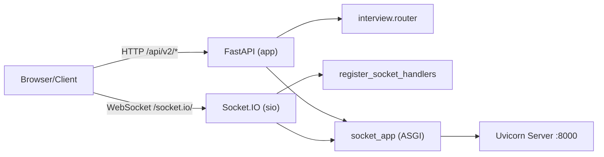

# `main.py` — Application Entry Point

**Location:** `backend/main.py`  
**Lines:** 35  
**Purpose:** Bootstraps the entire application — initializes the database, sets up FastAPI with CORS, creates the Socket.IO server, wires up routes, and starts Uvicorn.

---

## Full Code Breakdown

### Lines 1–7: Imports

```python
import uvicorn                                          # Line 1
import socketio                                         # Line 2
from fastapi import FastAPI                             # Line 3
from fastapi.middleware.cors import CORSMiddleware       # Line 4
from app.db import init_db                               # Line 5
from app.api.routes import interview                     # Line 6
from app.api.sockets.interview_socket import register_socket_handlers  # Line 7
```

| Import | Why It's Here |
|--------|---------------|
| `uvicorn` | ASGI server that runs the FastAPI app. It's the production-grade server that handles HTTP connections. |
| `socketio` | Python Socket.IO library. Used to create a real-time WebSocket server for live interview communication. |
| `FastAPI` | The web framework class. Creating an instance of this gives us our REST API application. |
| `CORSMiddleware` | Cross-Origin Resource Sharing middleware. Without this, browsers would block requests from the frontend (different origin). |
| `init_db` | Function from `app/db.py` that creates all SQLAlchemy tables in the database if they don't exist. |
| `interview` | The router module containing all REST API endpoints. |
| `register_socket_handlers` | Function that attaches all Socket.IO event handlers (like `join_interview`, `user_answer`) to the server. |

---

### Lines 9–10: Database Initialization

```python
# 1. Init DB
init_db()
```

**What happens:** Calls `Base.metadata.create_all(bind=engine)` which reads all SQLAlchemy model classes (that inherit from `Base`) and creates the corresponding tables in PostgreSQL/SQLite if they don't already exist.

**Why it's first:** Database tables must exist before any request handler tries to query or insert data. If a table is missing, the app would crash on the first API call.

---

### Lines 12–21: FastAPI Setup with CORS

```python
# 2. Setup FastAPI
app = FastAPI(title="Devsko AI Interview Production API")      # Line 13

app.add_middleware(                                             # Line 15
    CORSMiddleware,
    allow_origins=["*"],           # Line 17: Allow any frontend origin
    allow_credentials=True,        # Line 18: Allow cookies/auth headers
    allow_methods=["*"],           # Line 19: Allow GET, POST, PUT, DELETE, etc.
    allow_headers=["*"],           # Line 20: Allow any custom headers
)
```

| Parameter | Value | Meaning |
|-----------|-------|---------|
| `title` | `"Devsko AI Interview Production API"` | Shows up in auto-generated Swagger docs at `/docs` |
| `allow_origins=["*"]` | All origins | Any domain can call this API. In production, this should be restricted to the frontend domain. |
| `allow_credentials=True` | Enabled | Allows the frontend to send cookies and authorization headers. |
| `allow_methods=["*"]` | All HTTP methods | GET, POST, PUT, DELETE, PATCH, OPTIONS are all allowed. |
| `allow_headers=["*"]` | All headers | Custom headers like `Authorization` or `Content-Type` are accepted. |

---

### Lines 23–27: Socket.IO Server Setup

```python
# 3. Setup Socket.io
sio = socketio.AsyncServer(async_mode='asgi', cors_allowed_origins='*')  # Line 24
app.state.sio = sio                                                       # Line 25
socket_app = socketio.ASGIApp(sio, app)                                   # Line 26
register_socket_handlers(sio)                                              # Line 27
```

| Line | What It Does |
|------|-------------|
| **Line 24** | Creates an async Socket.IO server. `async_mode='asgi'` tells it to integrate with ASGI frameworks like FastAPI. `cors_allowed_origins='*'` allows any frontend to connect via WebSocket. |
| **Line 25** | Attaches the `sio` server instance to FastAPI's `app.state` so that REST route handlers can access it (e.g., to emit Socket events from HTTP endpoints). |
| **Line 26** | Wraps both the Socket.IO server and FastAPI app into a single ASGI application. Socket.IO intercepts `/socket.io/` requests, everything else falls through to FastAPI. |
| **Line 27** | Registers all event handlers (`join_interview`, `user_answer`, `discovery_start`, `terminate_interview`) on the Socket.IO server. |

#### Why wrap `socket_app = socketio.ASGIApp(sio, app)`?

Socket.IO and FastAPI are both ASGI apps. By wrapping them, we get a single application object where:
- WebSocket connections to `/socket.io/` are handled by `sio`
- All other HTTP requests are handled by `app` (FastAPI)

---

### Lines 29–31: Route Registration

```python
# 4. Include Routes
app.include_router(interview.router, prefix="/api/v2", tags=["interview"])          # Line 30
app.include_router(interview.router, prefix="/api", tags=["interview-legacy"])      # Line 31
```

| Line | What It Does |
|------|-------------|
| **Line 30** | Mounts all interview REST endpoints under `/api/v2/`. For example, `POST /api/v2/sessions` |
| **Line 31** | Mounts the **same** router again under `/api/` for backward compatibility. This means `/api/sessions` and `/api/v2/sessions` both work. |

**Why two prefixes?** The `v2` prefix is the current version. The `/api/` prefix exists so that older clients (legacy frontend) that haven't updated their URLs still work.

---

### Lines 33–35: Server Startup

```python
if __name__ == "__main__":
    uvicorn.run("main:socket_app", host="0.0.0.0", port=8000, reload=True)
```

| Parameter | Value | Meaning |
|-----------|-------|---------|
| `"main:socket_app"` | Import string | Tells Uvicorn to import the `socket_app` variable from the `main` module. This is the combined Socket.IO + FastAPI app. |
| `host="0.0.0.0"` | All interfaces | The server listens on all network interfaces, making it accessible from other machines (not just localhost). |
| `port=8000` | Port number | The server runs on port 8000. Access it at `http://localhost:8000`. |
| `reload=True` | Auto-reload | Uvicorn watches for file changes and automatically restarts the server. This is a **development-only** feature. |

---

## Connection Diagram


