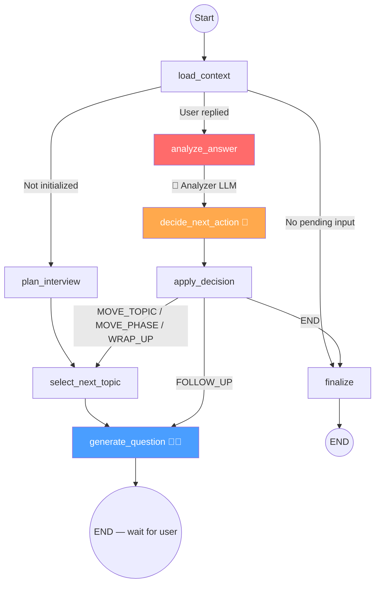
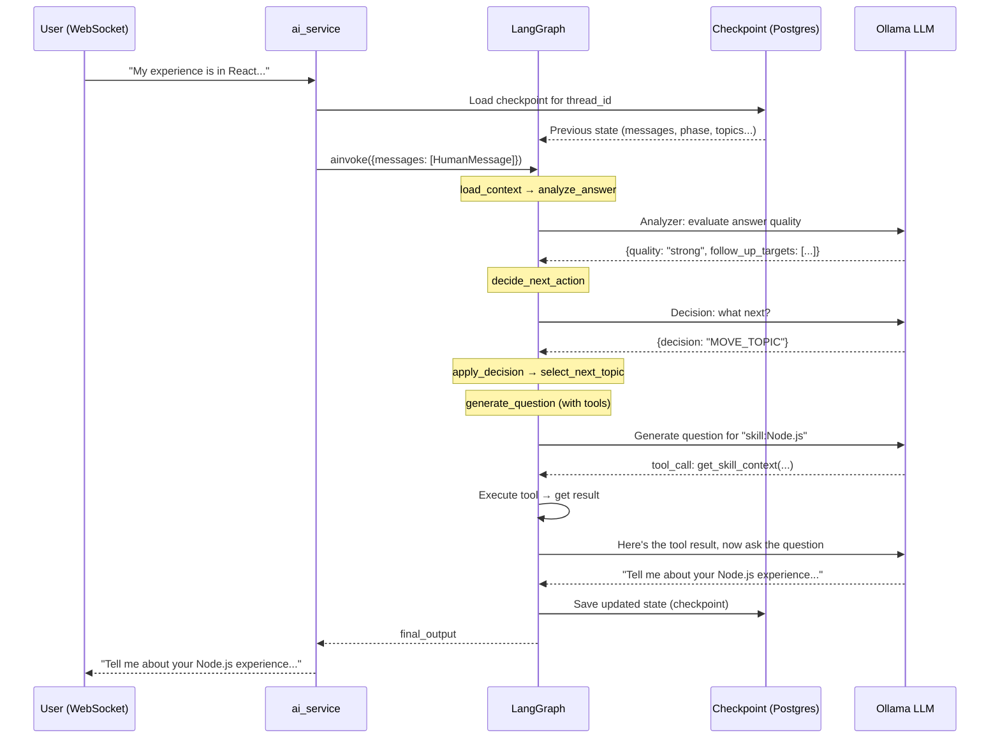

# How Your LangGraph Agent Works — Full Breakdown

## The Big Picture

Your system is NOT a single "agent" — it's a **state machine** with **8 nodes** where 3 of those nodes call an LLM, and 1 of those LLM nodes (the interviewer) can also call tools. LangGraph orchestrates the flow.



**🤖 = LLM call, 🔧 = can use tools**

---

## Step-by-Step: What Happens When a User Sends a Message

### Turn 1 — First time (no history)

```
WebSocket message → ai_service._execute_graph()
```

1. **No checkpoint exists** → builds full `input_state` with empty messages + session data (line 132-160 in `ai_service.py`)
2. Calls `app.ainvoke(input_state, config)` — this runs the **entire graph once**:

| Step | Node | What happens |
|------|------|--------------|
| 1 | `load_context` | Fetches JD, resume, skills from database. Builds `context` string. |
| 2 | **Router** `route_from_context` | `interview_initialized = False` → routes to `plan_interview` |
| 3 | `plan_interview` | Extracts resume topics + skill topics → builds `topic_queue` |
| 4 | `select_next_topic` | Picks first topic, sets `phase = OPENING` |
| 5 | `generate_question` 🤖🔧 | **LLM call** — generates opening question (may use tools) |
| 6 | **END** | Graph halts. Returns state with `is_waiting_for_user = True` |

3. Checkpoint saved to Postgres/SQLite automatically.

### Turn 2+ — User responds

```
WebSocket message with user's answer → ai_service._execute_graph()
```

1. **Checkpoint exists** → only sends `{messages: [HumanMessage], session_id}` as update (line 163-167)
2. LangGraph **loads previous state from checkpoint**, merges the new message, and reruns the graph:

| Step | Node | What happens |
|------|------|--------------|
| 1 | `load_context` | Reloads context from DB (same data, ensures freshness) |
| 2 | **Router** | Last message is `HumanMessage` → routes to `analyze_answer` |
| 3 | `analyze_answer` 🤖 | **Analyzer LLM** evaluates answer quality → returns JSON with scores |
| 4 | `decide_next_action` 🤖 | **Decision LLM** decides: `FOLLOW_UP` / `MOVE_TOPIC` / `MOVE_PHASE` / `WRAP_UP` / `END` |
| 5 | `apply_decision` | Applies the decision deterministically (updates phase, topics, depth) |
| 6 | **Router** `route_after_decision` | Routes based on decision |
| 7 | `select_next_topic` *(if topic/phase changed)* | Picks next topic from queue |
| 8 | `generate_question` 🤖🔧 | **Interviewer LLM** generates next question (may use tools) |
| 9 | **END** | Graph halts again |

---

## How Tool Calling Works Inside `generate_question`

This is the key "agentic" part. The function `_invoke_interviewer_with_tools` implements a **ReAct-style tool loop**:

### The Setup

```python
chain = get_interviewer_chain(with_tools=True)  # LLM with tools bound
```

This does `llm.bind_tools(interviewer_tools)` — tells the LLM about 5 available tools:

| Tool | What it does | When LLM calls it |
|------|------------|-------------------|
| `get_company_context` | Fetches company/JD from DB | When grounding a question in company details |
| `get_resume_context` | Fetches resume from DB | Before resume-verification questions |
| `get_skill_context` | Fetches active skill + questions | When probing a specific skill |
| `get_technical_definition` | Looks up a term definition | When the LLM needs a precise definition |
| `check_jd_requirement` | Checks if a skill is in the JD | When verifying JD relevance |

### The Loop (ReAct Pattern)

```
┌──────────────────────────────────────────────────────┐
│                                                      │
│  1. Send prompt + messages + tool schemas to LLM     │
│                          ↓                           │
│  2. LLM responds with either:                        │
│     ├─ TEXT response → Done! Return the question     │
│     └─ TOOL CALL(s) → Continue ↓                     │
│                          ↓                           │
│  3. Execute each tool, get results                   │
│                          ↓                           │
│  4. Append ToolMessages to conversation              │
│                          ↓                           │
│  5. Re-invoke LLM with updated messages ──→ Go to 2  │
│                                                      │
└──────────────────────────────────────────────────────┘
```

---

## What Makes This "Agentic" vs "Just Prompting"

| Feature | Plain Prompting | Your System |
|---------|----------------|-------------|
| Flow control | Fixed script | LLM decides (FOLLOW_UP vs MOVE_TOPIC vs END) |
| Tool use | None | LLM autonomously calls tools when it needs data |
| Multi-step reasoning | One prompt → one response | Analyzer → Decision → Interviewer chain per turn |
| State persistence | None | Full state checkpointed to Postgres between turns |
| Conditional routing | Linear | `route_from_context` + `route_after_decision` branch dynamically |

---

## State Lifecycle Summary



---

## 4. The "Outer Loop" — How Communication Loops

The "loop" isn't a single running process. It is an **event-driven cycle** triggered by the user's actions over a WebSocket (Socket.io).

### The Cycle of a Turn

| Path | Action | Component |
|------|--------|-----------|
| **1. Inbound** | User types an answer and hits "Send" | **Frontend** |
| **2. Trigger** | `user_answer` event received | **Socket Handler** |
| **3. Persist** | Save user message to the SQL Transcript table | **Database** |
| **4. Activate** | Call `ai_service.get_interview_turn()` | **AI Service** |
| **5. Load** | Load latest graph state from the Checkpoint table | **LangGraph Checkpointer** |
| **6. Run** | Execute nodes (Analyze → Decide → Question) | **LangGraph Agent** |
| **7. Save** | Checkpointer serializes new state back to DB | **Database** |
| **8. Outbound** | Emit `transcript_update` & `next_question` to user | **Socket Handler** |

### Why it feels like a "Loop"
It feels like a loop because the **State (Checkpoint)** is preserved. 
1. The graph runs to a finish line (`END`).
2. It "dies" but leaves a "save file" (the checkpoint).
3. When the user responds, it "wakes up" from that exact save file.
4. It processes the new information and reaches the finish line again.
