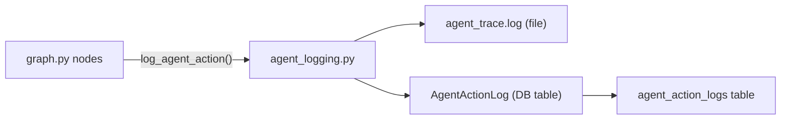

# `app/core/agent_logging.py` — Agent Action Audit Trail

**Location:** `backend/app/core/agent_logging.py`  
**Lines:** 88  
**Purpose:** Provides functions for logging every action the AI agent takes — LLM calls, tool executions, node entries/exits, routing decisions — both to a file and to the database for auditing.

---

## Function Reference

### `_json_safe(value)` — Lines 11–18

Recursively converts arbitrary Python objects into JSON-serializable types. Handles:
- Primitives (`str`, `int`, `float`, `bool`, `None`) → returned as-is
- `dict` → recursively converts keys to strings and values
- `list`/`tuple` → recursively converts each item
- Everything else → converted to `str(value)`

**Why needed?** LangChain message objects and state values can contain non-serializable types. This prevents crashes when storing logs as JSON.

---

### `serialize_message(message)` — Lines 21–42

Converts a LangChain `BaseMessage` into a simple dict for logging.

| Message Type | `role` Value | Extra Fields |
|-------------|-------------|-------------|
| `HumanMessage` | `"user"` | — |
| `AIMessage` | `"assistant"` | `tool_calls` (if present) |
| `ToolMessage` | `"tool"` | `tool_call_id`, `name` |
| Other | `"message"` | — |

**Output format:**
```json
{
  "role": "assistant",
  "content": "Let's talk about your Python experience...",
  "tool_calls": [...]  // only for AI messages with tool calls
}
```

---

### `snapshot_state(state)` — Lines 45–61

Creates a serializable snapshot of the current interview state for logging. Only includes the **last 8 messages** to keep payloads manageable.

**Fields captured:**
- `session_id`, `candidate_name`, `phase`, `current_topic`
- `topic_depth`, `max_topic_depth`, `completed_topics`, `topic_queue`
- `coverage_summary`, `last_decision`, `last_analysis`
- `guardrail_flags`, `messages` (last 8, serialized)

---

### `log_agent_action(session_id, action_type, summary, payload, node_name)` — Lines 64–88

**The main logging function.** Called from every node in `graph.py`.

**Two logging targets:**
1. **File log** (`agent_trace.log`): Appends a one-line entry for every action. Written to line 65–66. Useful for quick debugging.
2. **Database log** (`agent_action_logs` table): Creates an `AgentActionLog` record with full payload. Written to lines 70–81.

**Error handling:** If DB logging fails (e.g., connection issue), the error is logged but doesn't crash the interview. The `db.rollback()` ensures no partial writes.

**Action types used throughout the codebase:**
| Action Type | When It's Logged |
|------------|-----------------|
| `node_enter` | Start of each graph node |
| `node_exit` | End of each graph node |
| `llm_request` | Before calling any LLM |
| `llm_response` | After LLM responds |
| `tool_call` | Before executing a tool |
| `tool_result` | After tool returns |
| `route_decision` | When routing logic makes a choice |
| `graph_request` | AIService starts a graph run |
| `graph_response` | AIService gets final result |
| `graph_error` | Graph execution fails |

---

## Connection to the Database



The `AgentActionLog` model (from `models/database.py`) stores:
- `session_id` — Links to the interview session
- `node_name` — Which graph node logged this
- `action_type` — Category of action
- `summary` — Human-readable description
- `payload` — Full JSON payload (state snapshot, LLM inputs/outputs)
- `timestamp` — When the action occurred
