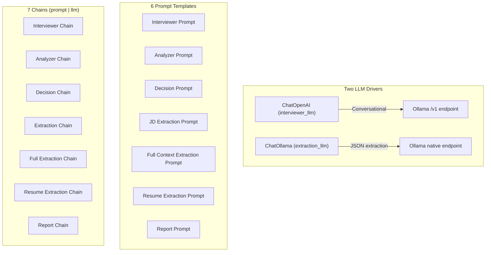

# `app/core/agents.py` — LLM Chains & Prompts

**Location:** `backend/app/core/agents.py`  
**Lines:** 274  
**Purpose:** Defines all LLM chain configurations and prompt templates. This file is the "brain" configuration — it sets up how each LLM call is structured, what system prompts they receive, and which models they use.

---

## Architecture Overview



---

## Lines 1–9: Imports & Environment Setup

```python
from langchain_ollama import ChatOllama           # Line 1
from langchain_openai import ChatOpenAI            # Line 2
from langchain_core.prompts import ChatPromptTemplate, MessagesPlaceholder  # Line 3
import os                                          # Line 4
from dotenv import load_dotenv                     # Line 5
from .tools import tools as interviewer_tools      # Line 7

load_dotenv()                                      # Line 9
```

---

## Lines 11–38: LLM Configuration

### API Key Setup (Lines 12–13)

```python
if not os.getenv("OPENAI_API_KEY"):
    os.environ["OPENAI_API_KEY"] = "ollama"
```

**Why:** `ChatOpenAI` requires an API key even when talking to Ollama. Setting it to `"ollama"` satisfies the validation without needing a real key.

### Base URL Normalization (Lines 16–20)

```python
raw_base_url = os.getenv("OLLAMA_BASE_URL", "http://localhost:11434").rstrip("/")
ollama_base_url = raw_base_url.replace("/v1", "").replace("/api", "")
openai_base_url = f"{ollama_base_url}/v1"
```

| Variable | Example Value | Used By |
|----------|---------------|---------|
| `ollama_base_url` | `http://localhost:11434` | `ChatOllama` — needs the bare URL |
| `openai_base_url` | `http://localhost:11434/v1` | `ChatOpenAI` — needs `/v1` suffix for OpenAI-compatible API |

### Interviewer LLM (Lines 23–29)

```python
interviewer_llm = ChatOpenAI(
    model=os.getenv("OLLAMA_MODEL", "llama3"),
    base_url=openai_base_url,
    api_key="ollama",
    streaming=False,
    timeout=60
)
```

Uses `ChatOpenAI` driver because it supports **tool binding** which the interviewer needs. `streaming=False` because the app collects the full response before emitting it.

### Extraction LLM (Lines 32–38)

```python
extraction_llm = ChatOllama(
    model=os.getenv("OLLAMA_MODEL", "llama3"),
    base_url=ollama_base_url,
    temperature=0.0,
    num_ctx=4096,
    timeout=60
)
```

Uses `ChatOllama` driver for **native Ollama speed**. `temperature=0.0` ensures deterministic JSON output. `num_ctx=4096` sets the context window size.

---

## Function-by-Function Reference

### `get_interviewer_prompt()` → Lines 41–61

Returns the system prompt for the interviewer AI. Key variables injected:
- `{candidate_name}` — The candidate's actual name
- `{context}` — Full context summary (JD, resume, company info)
- `{skills_prompt}` — Active agent skills instructions
- `{follow_up_guidance}` — Follow-up targets from the analyzer
- `{messages}` — Full conversation history via `MessagesPlaceholder`

**Key instructions in the prompt:**
1. No preamble or AI disclaimers
2. Introduce as "Alex from Devsko"
3. Never use placeholder brackets
4. Speak naturally like a real person on a video call

### `get_interviewer_chain(llm, with_tools, tool_choice)` → Lines 63–77

Creates the interviewer chain with optional tool binding.

```python
def get_interviewer_chain(llm=interviewer_llm, with_tools=False, tool_choice=None):
    prompt = get_interviewer_prompt()
    if with_tools:
        model_name = getattr(llm, "model_name", getattr(llm, "model", "")).lower()
        if "llama3" in model_name and "3.1" not in model_name:
            pass  # Skip tools for legacy llama3 v1
        else:
            try:
                llm = llm.bind_tools(interviewer_tools, tool_choice=tool_choice)
            except Exception:
                pass  # Graceful fallback
    return prompt | llm   # LangChain LCEL: pipe operator chains prompt → LLM
```

**The `|` operator** is LangChain Expression Language (LCEL). `prompt | llm` means: "first format the prompt, then pass it to the LLM."

### `get_analyzer_prompt()` / `get_analyzer_chain()` → Lines 79–111

The analyzer evaluates candidate answers and returns JSON:
```json
{
  "answer_quality": "strong | adequate | weak | evasive",
  "clarity_score": 0-10,
  "accuracy_score": 0-10,
  "depth_level": "L0 | L1 | L2 | L3",
  "evidence_found": ["..."],
  "missing_evidence": ["..."],
  "follow_up_targets": ["..."],
  "move_on_confidence": 0.0-1.0,
  "resume_verification_signal": "verified | unclear | suspicious | not_applicable",
  "risk_flags": ["..."]
}
```

### `get_decision_prompt()` / `get_decision_chain()` → Lines 114–153

The decision engine chooses the next action:
```json
{
  "decision": "FOLLOW_UP | MOVE_TOPIC | MOVE_PHASE | WRAP_UP | END",
  "reason": "...",
  "confidence": 0.0-1.0
}
```

**Decision rules built into the prompt:**
- `FOLLOW_UP`: More evidence needed on current topic
- `MOVE_TOPIC`: Current topic covered, more topics remain
- `MOVE_PHASE`: Current phase complete, move to next
- `WRAP_UP`: Technical questioning should stop
- `END`: Interview in WRAP_UP, should terminate

### `get_extraction_prompt()` / `get_extraction_chain()` → Lines 155–179

Extracts skills from a job description. Handles edge cases:
- Non-technical JDs (Sales, HR) → relevant domain skills
- Sparse JDs → infer standard industry skills
- Nonsense input → generic professional skills

### `get_full_extraction_prompt()` / `get_full_extraction_chain()` → Lines 181–205

Enhanced version that takes all context (JD + resume + company info + candidate name) for a holistic skill analysis.

### `get_resume_extraction_prompt()` / `get_resume_extraction_chain()` → Lines 207–218

Parses raw resume text into structured JSON covering:
- Professional Experience
- Key Skills
- Education
- Projects

### `get_report_prompt()` / `get_report_chain()` → Lines 220–274

Generates the final evaluation report with three analysis layers:
1. **Individual Question Analysis** — Technical accuracy per question
2. **Skill/Topic Thread Synthesis** — L1-L3 depth ceiling per skill
3. **Professional Verification** — Resume honesty check

Returns a comprehensive JSON report with overall score, hiring verdict, topic-level scores, and soft skills assessment.
