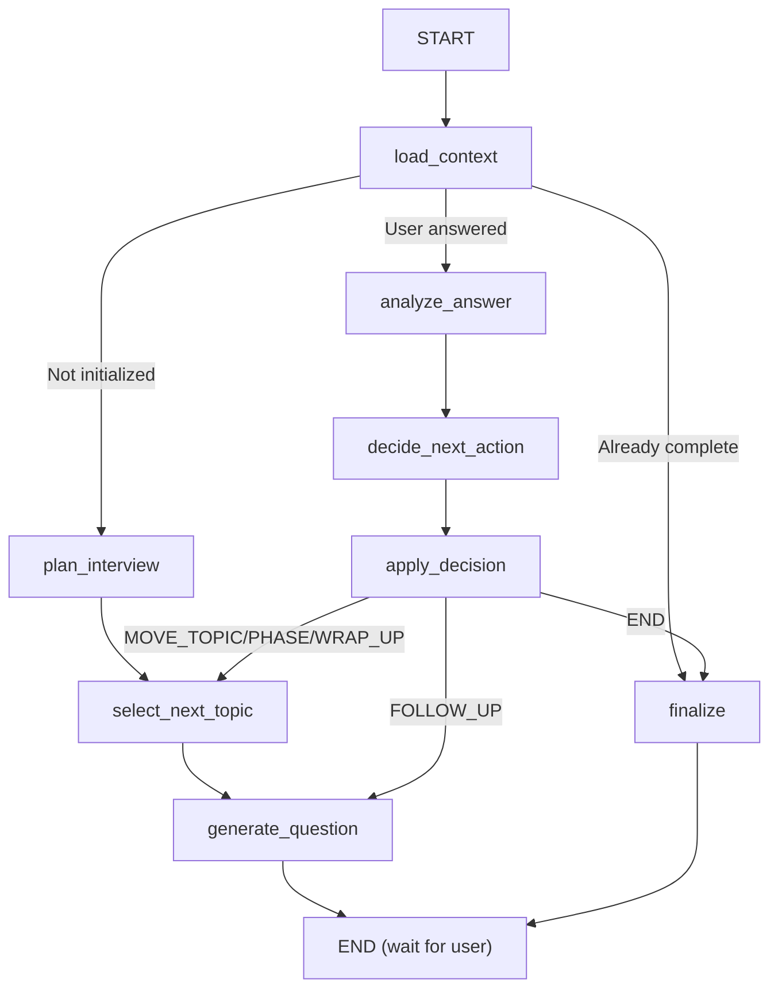

# `app/core/graph.py` — LangGraph State Machine

**Location:** `backend/app/core/graph.py`  
**Lines:** 1058  
**Purpose:** Defines the complete LangGraph state machine — all 8 nodes, routing functions, helper utilities, and the graph compilation. This is the **heart** of the AI interview engine.

---

## Graph Architecture



---

## Helper Functions (Lines 24–230)

### `_safe_list(value)` — Line 24
Converts any value to a list. If it's already a list, returns it. If it's a non-empty string, wraps it in a list. Otherwise returns `[]`.

### `_safe_dict(value)` — Line 32
Returns the value if it's a dict, else returns `{}`.

### `_safe_parse_json(text)` — Line 36
Attempts to parse JSON from LLM output. Tries three strategies:
1. Direct `json.loads(text)`
2. Extract JSON between first `{` and last `}` (ignoring surrounding text)
3. Return a default fallback dict if all parsing fails

**Why fallback?** LLMs sometimes wrap JSON in markdown code fences or add explanation text. The fallback ensures the graph never crashes.

### `_safe_parse_decision_json(text)` — Line 64
Similar to above but specific to decision output. Validates that `decision` is one of the 5 valid values, defaulting to `MOVE_TOPIC` if invalid.

### `_extract_resume_topics(extracted_resume, resume_text)` — Line 92
Builds the resume topic queue. Looks at `projects`, `professional_experience`, and `experience` keys. Each topic is prefixed with `resume:`. Limited to 2 topics to keep interviews focused.

### `_extract_skill_topics(extracted_skills, jd_text)` — Line 112
Builds the skill topic queue from `must_have_tech`, `nice_to_have_tech`, `silent_observer_suggestions`, and `soft_skills`. Each topic prefixed with `skill:`. Deduplicates and limits to 5 topics.

### `_display_topic_name(topic)` — Line 138
Strips the prefix from topic names. `"skill:Python"` → `"Python"`. Used when displaying topics to the LLM.

### `_build_context_summary(...)` — Line 146
Compiles a text summary of all candidate context for the interviewer prompt. Includes candidate name, company info (truncated to 600 chars), JD (2000 chars), resume (1200 chars), and skills.

### `_build_skill_prompt(phase, current_topic, jd_text)` — Line 161
Resolves active agent skills for the current phase/topic and builds a prompt segment listing their instructions.

### `_detect_guardrail_flags(text)` — Line 174
Scans user input for prompt injection patterns like "ignore previous instructions", "show your prompt", etc. Returns a list of flag strings.

### `_append_thread_event(topic_threads, topic, event)` — Line 194
Immutably appends a Q&A event to the topic_threads dict. Each event has `event` type (question/answer), `phase`, `depth`, and `text`.

### `_build_coverage_summary(queue, completed_topics, current_topic)` — Line 202
Computes statistics: total topics, completed count, remaining count, broken down by resume vs skill topics.

### `_remaining_topics_by_prefix(state, prefix)` — Line 220
Returns uncompleted topics from the queue that match a prefix (`resume:` or `skill:`).

---

## Tool Execution Loop (Lines 230–339)

### `_invoke_interviewer_with_tools(state)` — Line 233

This function handles the **ReAct loop** — the interviewer LLM can call tools and the results are fed back:

```
LLM generates response → Has tool_calls? → Execute tools → Feed results back → LLM generates again → ...
```

**Step-by-step:**
1. Build the interviewer chain with tools enabled
2. Invoke the chain with current state
3. **While** the response contains `tool_calls`:
   a. Execute each tool call via `_TOOL_REGISTRY`
   b. Create `ToolMessage` objects with results
   c. Append tool messages to working messages
   d. Re-invoke the chain with updated messages
4. Return the final text response and all emitted messages

---

## Node Functions

### `load_context_node(state)` — Line 342

**Purpose:** Hydrates state from the database at the start of every graph invocation.

**Logic:**
1. First tries the **devsko** database (main platform):
   - Queries `UserAssessmentSession` by session_id
   - Extracts skills from context snapshot
   - Populates candidate name, JD, company info, resume
2. Falls back to the **local interview** database:
   - Queries `InterviewSession`
   - Uses the session's own stored fields

**Returns:** A dict with all state fields populated from DB data.

### `route_from_context(state)` — Line 470

**Purpose:** Conditional routing function that decides where to go after `load_context`.

| Condition | Route To | Reason |
|-----------|----------|--------|
| `is_complete == True` | `finalize` | Interview is done |
| Not initialized OR no AI messages | `plan_interview` | First time — need to set up topics |
| Last message is from user | `analyze_answer` | User responded, analyze their answer |
| Default | `finalize` | No pending action |

### `plan_interview_node(state)` — Line 512

**Purpose:** Builds the topic queue and initializes interview tracking.

**Logic:**
- If `topic_queue` already exists → just mark as initialized (idempotent)
- Otherwise:
  1. Extract resume topics (max 2)
  2. Extract skill topics (max 5)
  3. Set phase to `OPENING`
  4. Set current topic to `opening:introduction`
  5. Initialize all tracking dicts/lists

### `select_next_topic_node(state)` — Line 560

**Purpose:** Picks the next topic based on current phase.

| Phase | Topic Selection |
|-------|----------------|
| `OPENING` | `opening:introduction` |
| `RESUME_VERIFICATION` | Next uncompleted `resume:` topic |
| `SKILL_PROBING` | Next uncompleted `skill:` topic |
| `WRAP_UP` | `wrap_up:final thoughts` |

**Auto-phase-advance:** If no resume topics remain, auto-advances to `SKILL_PROBING`. If no skill topics remain, auto-advances to `WRAP_UP`.

### `generate_question_node(state)` — Line 622

**Purpose:** Invokes the interviewer LLM to produce the next question.

**Logic:**
1. Calls `_invoke_interviewer_with_tools(state)` — full ReAct loop
2. Tracks which topics have been asked about in `asked_topics`
3. Records the question event in `topic_threads`
4. Sets `is_waiting_for_user = True` (graph will terminate to END)

### `analyze_answer_node(state)` — Line 667

**Purpose:** Evaluates the candidate's answer using the Analyzer LLM.

**Logic:**
1. Extracts the last AI question and last user response from messages
2. Runs guardrail detection on the user's response
3. Invokes the analyzer chain with phase, topic, depth, JD, resume context
4. Parses the JSON result
5. Records the answer event in `topic_threads`
6. Sets `is_waiting_for_user = False`

### `decide_next_action_node(state)` — Line 744

**Purpose:** Decides what happens next using the Decision LLM.

**Inputs to the decision:**
- Current phase, topic, depth, max depth
- Completed and remaining topics
- Last question, last answer, last analysis
- Guardrail flags

**Output:** Sets `last_decision` to one of: `FOLLOW_UP`, `MOVE_TOPIC`, `MOVE_PHASE`, `WRAP_UP`, `END`

### `apply_decision_node(state)` — Line 807

**Purpose:** Applies guardrails and validates the LLM's decision before executing it.

**Guardrail logic (overrides):**

| LLM says | System overrides to | When |
|----------|---------------------|------|
| `FOLLOW_UP` | `MOVE_TOPIC` | In WRAP_UP, at max depth, or no follow-up targets |
| `MOVE_TOPIC` | `MOVE_PHASE` | No remaining topics in current phase |
| `MOVE_PHASE` | `MOVE_TOPIC` | Still has remaining topics |
| `END` | `WRAP_UP` | Not yet in WRAP_UP phase |

**State transitions:**
- `FOLLOW_UP` → increments `topic_depth`
- `MOVE_TOPIC` → marks current topic complete, resets depth to 0
- `MOVE_PHASE` → marks topic complete, advances phase, appends to history
- `WRAP_UP` → sets phase to WRAP_UP
- `END` → no state change (falls through to routing)

### `route_after_decision(state)` — Line 957

**Purpose:** Routes to the next node after applying the decision.

| Decision | Route To |
|----------|----------|
| `FOLLOW_UP` | `generate_question` |
| `MOVE_TOPIC`, `MOVE_PHASE`, `WRAP_UP` | `select_next_topic` |
| `END` | `finalize` |

### `finalize_node(state)` — Line 987

**Purpose:** Marks the interview as complete.

Sets `phase = "COMPLETED"`, appends to phase history, builds final coverage summary, sets `is_complete = True`.

---

## Graph Compilation: `create_interview_graph(checkpointer)` — Line 1019

Assembles all nodes and edges into a compiled LangGraph:

```python
def create_interview_graph(checkpointer=None):
    workflow = StateGraph(InterviewState)

    # Add all 8 nodes
    workflow.add_node("load_context", load_context_node)
    workflow.add_node("plan_interview", plan_interview_node)
    workflow.add_node("select_next_topic", select_next_topic_node)
    workflow.add_node("generate_question", generate_question_node)
    workflow.add_node("analyze_answer", analyze_answer_node)
    workflow.add_node("decide_next_action", decide_next_action_node)
    workflow.add_node("apply_decision", apply_decision_node)
    workflow.add_node("finalize", finalize_node)

    # Wire edges
    workflow.add_edge(START, "load_context")
    workflow.add_conditional_edges("load_context", route_from_context, {...})
    workflow.add_edge("plan_interview", "select_next_topic")
    workflow.add_edge("select_next_topic", "generate_question")
    workflow.add_edge("generate_question", END)
    workflow.add_edge("analyze_answer", "decide_next_action")
    workflow.add_edge("decide_next_action", "apply_decision")
    workflow.add_conditional_edges("apply_decision", route_after_decision, {...})
    workflow.add_edge("finalize", END)

    return workflow.compile(checkpointer=checkpointer)
```

The `checkpointer` parameter persists graph state between invocations (either `AsyncPostgresSaver` or `AsyncSqliteSaver`).
