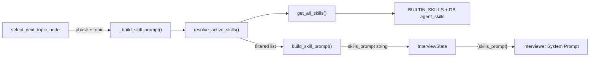

# `app/core/skills.py` — Agent Skill System

**Location:** `backend/app/core/skills.py`  
**Lines:** 134  
**Purpose:** Manages a dynamic skill system where "skills" are instruction sets that modify the interviewer's behavior based on the current topic and phase. Supports both built-in and database-stored custom skills.

---

## Concept: What is an Agent Skill?

A **skill** is NOT a candidate's skill — it's an **instruction set** that tells the interviewer AI how to behave in a specific context. Think of it like a "mode" the interviewer switches into.

For example, the `backend-depth` skill tells the interviewer:
> "Bias questions toward API contracts, database design, concurrency, error handling, observability, scaling bottlenecks, and production tradeoffs."

---

## Data Structure

### `SkillDefinition` (Lines 8–14)

```python
@dataclass
class SkillDefinition:
    name: str              # Unique identifier (e.g., "resume-verification")
    description: str       # Human-readable summary  
    instructions: str      # Prompt text injected into the interviewer's system message
    topic_keywords: list   # Keywords that trigger this skill (e.g., ["api", "database"])
    phases: list           # Phases where this skill is active (e.g., ["PROBING"])
    source: str            # "builtin" or "custom" (from DB)
```

---

## Built-in Skills (Lines 16–67)

| Skill Name | Active Phase | Trigger Keywords | Purpose |
|-----------|-------------|-----------------|---------|
| `resume-verification` | VERIFICATION | experience, resume, project, ownership | Forces deep-dive into resume claims |
| `backend-depth` | PROBING | backend, api, database, python, fastapi, sql, redis, system design | Pushes for backend architecture depth |
| `frontend-depth` | PROBING | frontend, react, next.js, typescript, ui, browser | Pushes for frontend/rendering depth |
| `debugging` | PROBING | debug, bug, incident, failure, troubleshooting | Asks diagnostic/failure-analysis questions |
| `system-design` | PROBING | architecture, system, design, scaling, distributed | Drives architecture/scaling questions |

---

## Function Reference

### `_normalize(value)` — Line 69
Lowercases, replaces hyphens/underscores with spaces, and collapses whitespace. Used for fuzzy matching.

### `_matches_keywords(topic, jd_text, keywords)` — Line 72
Checks if any keyword appears in the combined topic + JD text (after normalization). Returns `True` if there's any match.

### `_from_db_model(skill: AgentSkill)` — Line 76
Converts a SQLAlchemy `AgentSkill` model into a `SkillDefinition` dataclass. Sets `source="custom"`.

### `get_builtin_skills()` — Line 86
Returns a copy of the `BUILTIN_SKILLS` list. The copy prevents accidental mutation of the global list.

### `get_custom_skills(db)` — Line 89
Queries the `agent_skills` table for all active skills (`is_active == True`) and converts them to `SkillDefinition` objects.

### `get_all_skills(db)` — Line 92
Combines built-in + custom skills into a single list.

### `resolve_active_skills(db, session_state, jd_text, explicit_skill_names)` — Line 95

**This is the main function.** It determines which skills should be active for the current turn.

**Selection logic:**
1. Get all skills (built-in + DB)
2. For each skill, check three conditions:
   - **Explicit match:** Skill name is in `explicit_skill_names` list
   - **Phase match:** Skill's phases list is empty (always active) OR current phase is in the list
   - **Topic match:** Skill's keywords list is empty (always active) OR any keyword matches the current topic/JD
3. Include the skill if it's explicitly named OR (both phase AND topic match)
4. Deduplicate by normalized name

### `build_skill_prompt(skills)` — Line 126

Formats active skills into a prompt text block:
```
ACTIVE AGENT SKILLS:
- resume-verification (builtin): Anchor questions in concrete past work...
- backend-depth (builtin): Bias questions toward API contracts...
```

This text is injected into the interviewer's system prompt via `{skills_prompt}`.

---

## How Skills Flow Through the System


