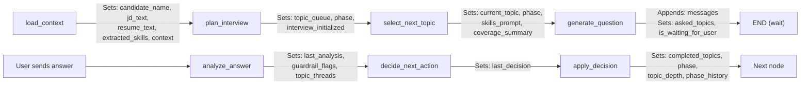

# `app/core/state.py` — Interview State Definition

**Location:** `backend/app/core/state.py`  
**Lines:** 37  
**Purpose:** Defines the `InterviewState` TypedDict — the single source of truth for all data flowing through the LangGraph state machine. Every node in the graph reads from and writes to this state.

---

## Full Code Breakdown

### Lines 1–3: Imports

```python
from typing import Annotated, Sequence, TypedDict   # Line 1
from langchain_core.messages import BaseMessage      # Line 2
import operator                                      # Line 3
```

| Import | Why It's Here |
|--------|---------------|
| `Annotated` | Used to attach metadata (like a reducer function) to type hints. LangGraph uses this to know *how* to merge state updates. |
| `Sequence` | Generic sequence type. `Sequence[BaseMessage]` means any ordered collection of messages. |
| `TypedDict` | Creates a dictionary type with specific keys and value types. LangGraph requires state to be a TypedDict. |
| `BaseMessage` | LangChain's base class for messages. `HumanMessage`, `AIMessage`, and `ToolMessage` all inherit from this. |
| `operator` | Python's built-in operator module. `operator.add` is used as a reducer to concatenate message lists instead of replacing them. |

---

### Lines 5–6: Messages with Reducer

```python
class InterviewState(TypedDict):
    messages: Annotated[Sequence[BaseMessage], operator.add]    # Line 6
```

**This is the most important field.** The `Annotated[..., operator.add]` tells LangGraph:

> "When a node returns `{"messages": [new_msg]}`, **append** it to the existing messages list instead of replacing it."

Without this annotation, returning `{"messages": [msg]}` would wipe out all previous messages. With `operator.add`, messages accumulate across the entire conversation.

---

### Lines 8–18: Session & Context Fields

```python
    session_id: str              # Line 8  - Unique identifier for this interview session
    candidate_name: str          # Line 9  - Name of the candidate being interviewed
    phase: str                   # Line 10 - Current interview phase (OPENING, RESUME_VERIFICATION, etc.)
    current_topic: str           # Line 11 - Current topic being discussed (e.g., "skill:Python")
    jd_text: str                 # Line 12 - Full job description text
    company_info: str            # Line 13 - Company context information
    resume_text: str             # Line 14 - Raw text extracted from candidate's resume PDF
    extracted_resume: dict       # Line 15 - AI-parsed structured resume data (projects, skills, etc.)
    extracted_skills: dict       # Line 16 - Skills extracted from JD (must_have_tech, soft_skills, etc.)
    skills_prompt: str           # Line 17 - Dynamic prompt segment listing active agent skills
    context: str                 # Line 18 - Compiled context string fed into the interviewer prompt
```

| Field | Populated By | Used By |
|-------|-------------|---------|
| `session_id` | `_execute_graph()` in AIService | All nodes, for DB lookups and logging |
| `candidate_name` | `load_context` node | Interviewer prompt, decision prompt |
| `phase` | `plan_interview`, `apply_decision` | Routing logic, topic selection |
| `current_topic` | `select_next_topic` | Interviewer question focus |
| `jd_text` | `load_context` | Analyzer prompt, skill extraction |
| `skills_prompt` | `select_next_topic` | Injected into interviewer system prompt |
| `context` | `load_context` | Interviewer prompt — provides full candidate context |

---

### Lines 20–28: Topic & Coverage Tracking

```python
    topic_queue: list[str]       # Line 20 - Ordered list of all topics to cover
    completed_topics: list[str]  # Line 21 - Topics already discussed
    asked_topics: dict           # Line 22 - {topic: count} — how many questions asked per topic
    topic_threads: dict          # Line 23 - {topic: [events]} — Q&A history per topic
    topic_depth: int             # Line 24 - Current depth level for the active topic (0, 1, 2, 3)
    max_topic_depth: int         # Line 25 - Maximum follow-up depth allowed per topic (default: 3)
    coverage_summary: dict       # Line 26 - Statistics on topic coverage progress
    phase_history: list[str]     # Line 27 - Ordered list of phases traversed
    guardrail_flags: list[str]   # Line 28 - Security flags (e.g., "prompt_injection_attempt")
```

**Topic names follow a prefix convention:**
- `resume:Project Name` — Resume verification topics
- `skill:Python` — Technical skill probing topics
- `opening:introduction` — Opening phase marker
- `wrap_up:final thoughts` — Closing phase marker

---

### Lines 30–36: Analysis & Control Fields

```python
    last_user_response: str           # Line 30 - The candidate's most recent answer text
    last_analysis: dict               # Line 31 - Result from Analyzer LLM (quality, depth, flags)
    last_decision: str                # Line 32 - Result from Decision LLM (FOLLOW_UP, MOVE_TOPIC, etc.)

    interview_initialized: bool       # Line 34 - Whether plan_interview has run
    is_waiting_for_user: bool         # Line 35 - Whether the graph should pause for user input
    is_complete: bool                 # Line 36 - Whether the interview is finished
```

| Field | Purpose |
|-------|---------|
| `last_analysis` | JSON with `answer_quality`, `clarity_score`, `accuracy_score`, `depth_level`, `follow_up_targets`, `risk_flags` |
| `last_decision` | One of: `FOLLOW_UP`, `MOVE_TOPIC`, `MOVE_PHASE`, `WRAP_UP`, `END` |
| `is_waiting_for_user` | Set to `True` after generating a question. The graph terminates (returns to `END`), waiting for the next user message. |
| `is_complete` | Set to `True` by `finalize` node. No more questions will be asked. |

---

## How State Flows Through the Graph


