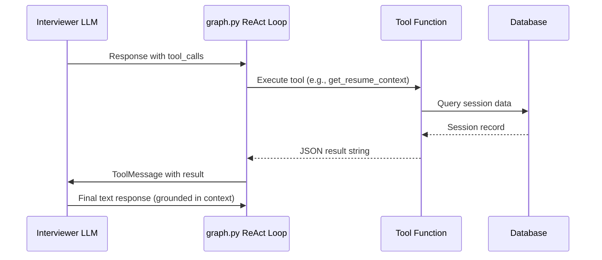

# `app/core/tools.py` — LangChain Tools

**Location:** `backend/app/core/tools.py`  
**Lines:** 155  
**Purpose:** Defines LangChain tools that the interviewer LLM can call during the ReAct loop. These tools allow the AI to fetch additional context from the database mid-conversation.

---

## What Are LangChain Tools?

Tools are functions that an LLM can decide to call. The `@tool` decorator makes a function available to the LLM with a description. The LLM reads the description and decides when to call it.

```
LLM thinks: "I need company context to ask a relevant question"
LLM calls: get_company_context(session_id="abc-123")
System: Executes the function, returns result
LLM: Uses the result to formulate a grounded question
```

---

## Helper Function

### `_get_session(session_id)` — Lines 10–38

**Purpose:** Looks up a session by ID across both databases.

**Logic:**
1. First tries the **devsko** database (`UserAssessmentSession`) — the main platform
2. If not found, falls back to the **local interview** database (`InterviewSession`)
3. Returns a tuple: `(session, error_string, source)` where source is `"main"` or `"local"`

**Why two databases?** Sessions created from the main Devsko platform have a `UserAssessmentSession` record. Sessions created directly via the REST API have only an `InterviewSession` record.

---

## Tool Functions

### `get_company_context(session_id)` — Lines 42–67

**Docstring:** _"Fetch company context for a session. Use when grounding a question or answer in company details."_

**For main sessions:**
- Reads from `contextsnapshot` → `user.name`, `job.company_info`, `job.job_description`

**For local sessions:**
- Reads from the session's own fields: `candidate_name`, `company_info`, `jd_text`

**Returns:** JSON string with `candidate_name`, `company_info`, `job_description`

---

### `get_resume_context(session_id)` — Lines 71–97

**Docstring:** _"Fetch resume details for a session. Use before asking a resume-verification or project-ownership question."_

**For main sessions:**
- Reads from `contextsnapshot` → `user.name`, `resume.text`, `resume.parsed`

**For local sessions:**
- Reads from session/JD fields: `resume_text`, `extracted_resume_details`

**Returns:** JSON string with `candidate_name`, `resume_text`, `extracted_resume`

---

### `get_skill_context(session_id, skill_id)` — Lines 101–125

**Docstring:** _"Fetch the active skill and related question context for a main interview session."_

**Only works for main Devsko sessions.** Returns `None` for local sessions.

**Logic:**
1. Gets `skills` and `questions` from context snapshot
2. Finds the active skill (by provided `skill_id` or from session state)
3. Finds up to 5 questions related to that skill
4. Returns JSON with `active_skill` and `related_questions`

---

### `get_technical_definition(term)` — Lines 129–137

**Docstring:** _"Lookup the technical definition of a specific programming term or concept."_

A simple lookup dictionary with predefined definitions for: `fastapi`, `pydantic`, `sqlalchemy`, `langgraph`.

Returns the definition or `"No definition found for {term}."` for unknown terms.

---

### `check_jd_requirement(requirement, jd_text)` — Lines 141–145

**Docstring:** _"Check whether a specific requirement is present in the job description text."_

Case-insensitive substring search. Returns a human-readable yes/no answer.

---

## Tool Registry (Lines 148–154)

```python
tools = [
    get_company_context,
    get_resume_context,
    get_skill_context,
    get_technical_definition,
    check_jd_requirement,
]
```

This list is:
1. Imported by `agents.py` and bound to the interviewer LLM via `llm.bind_tools(tools)`
2. Used in `graph.py` to build `_TOOL_REGISTRY` for the ReAct execution loop

---

## Tool Execution Flow


