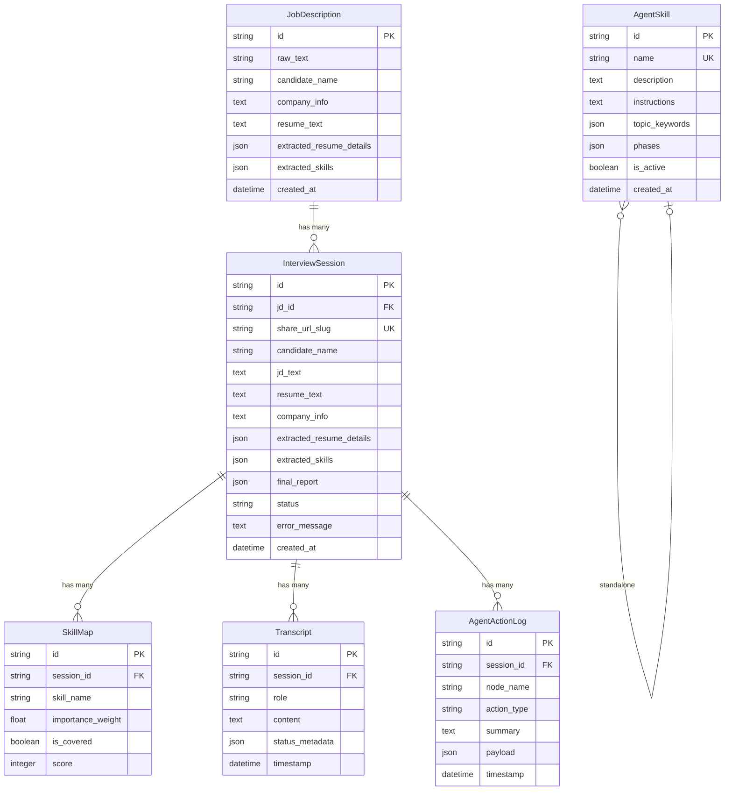
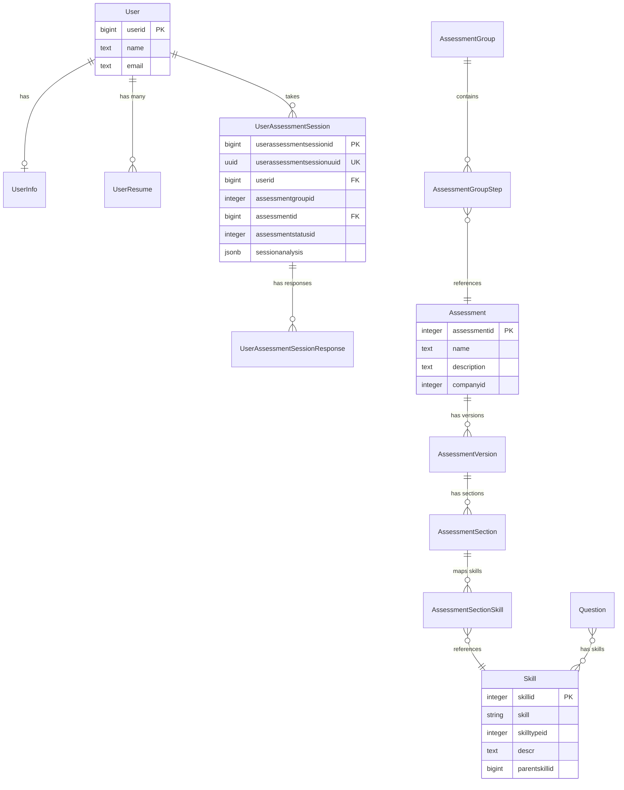

# `app/models/` — SQLAlchemy Database Models

This document covers both model files:
- `database.py` — Local interview database models
- `devsko.py` — Main Devsko platform models

---

# `database.py` — Local Interview DB Models

**Location:** `backend/app/models/database.py`  
**Lines:** 94  
**Purpose:** Defines all tables for the local `interview` database using SQLAlchemy ORM. All models inherit from `Base`.

---

## Entity Relationship Diagram

---

## Model Details

### `JobDescription` (Lines 9–23)
Stores the original job description and enrichment data.

| Column | Type | Purpose |
|--------|------|---------|
| `id` | String PK | UUID, auto-generated |
| `raw_text` | String | Original JD text from user |
| `candidate_name` | String(255) | Name of the candidate |
| `company_info` | Text | Company description/context |
| `resume_text` | Text | Raw text extracted from resume PDF |
| `extracted_resume_details` | JSON | AI-parsed resume structure |
| `extracted_skills` | JSON | AI-extracted skill map from JD |
| `sessions` | Relationship | Back-reference to `InterviewSession` |

### `InterviewSession` (Lines 25–47)
The core session table. Each interview creates one record.

| Column | Type | Purpose |
|--------|------|---------|
| `id` | String PK | UUID |
| `jd_id` | FK → `job_descriptions.id` | Links to the JD record |
| `share_url_slug` | String(255) UK | Short URL-safe identifier for sharing |
| `candidate_name` | String(255) | Candidate's name |
| `jd_text` | Text | Denormalized copy of JD text |
| `resume_text` | Text | Denormalized copy of resume text |
| `company_info` | Text | Denormalized company info |
| `extracted_resume_details` | JSON | Parsed resume |
| `extracted_skills` | JSON | Extracted skills |
| `final_report` | JSON | AI-generated evaluation report |
| `status` | String(50) | `PENDING` → `ANALYZING` → `READY` → `FAILED` |
| `error_message` | Text | Error details if status is FAILED |

### `SkillMap` (Lines 49–58)
Tracks individual skill coverage and scores during the interview.

### `Transcript` (Lines 60–69)
Stores the conversation history — every message from both agent and user.

| Column | Purpose |
|--------|---------|
| `role` | `"agent"` or `"user"` |
| `content` | The message text |
| `status_metadata` | JSON with agent state at the time (phase, topic, depth) |

### `AgentActionLog` (Lines 72–82)
Audit trail for every AI decision. Used by `agent_logging.py`.

### `AgentSkill` (Lines 84–93)
Custom skills stored in the database. Used by `skills.py` alongside built-in skills.

---

# `devsko.py` — Main Devsko Platform Models

**Location:** `backend/app/models/devsko.py`  
**Lines:** 179  
**Purpose:** Read-only SQLAlchemy models that map to the existing Devsko platform tables in the `devsko` database. These models use `DevskoBase` (separate from `Base`) and reference the `public` schema.

---

## Entity Relationship Diagram

---

## Model Details

### `User` (Lines 9–16)
Maps to `public.users`. Contains basic user identity.

### `UserInfo` (Lines 18–29)
Maps to `public.userinfo`. Extended profile (name, gender, city, phone).

### `UserResume` (Lines 32–41)
Maps to `public.userresumes`. The `resumetext` column is physically named `llmresponse` in the DB.

### `Skill` (Lines 44–52)
Maps to `public.skills`. Self-referencing via `parentskillid` for skill trees. The `skilltypeid` determines whether a skill is technical or soft:
- `16001`, `16008` → Soft skills
- Everything else → Technical skills

### `AssessmentGroup` (Lines 55–64)
Groups related assessments together. Has a UUID for external API access.

### `AssessmentGroupStep` (Lines 67–74)
Links assessments to groups with ordering (`steporder`).

### `Assessment` (Lines 77–85)
Individual assessment definitions with title and description.

### `AssessmentVersion` (Lines 88–95)
Version control for assessments. `isactive` (DB column `islive`) marks the live version.

### `AssessmentSection` (Lines 98–105)
Sections within an assessment version, ordered by `sectionorder`.

### `AssessmentSectionSkill` (Lines 108–115)
Maps skills to assessment sections with associated `questionids`.

### `Question` (Lines 118–128)
Question bank. Has `skillids` (array), `canfollowup`, `maxfollowupq`.

### `UserAssessmentSession` (Lines 131–148)
The main assessment session record. Key extended columns (added by migration):
- `contextsnapshot` — Full context JSON assembled by `ContextAssemblyService`
- `sessionanalysis` — JSONB for storing analysis, agent memory, etc.

### `UserAssessmentSessionResponse` (Lines 150–165)
Individual responses to questions during a session.

### `DynamicQuestion` (Lines 168–178)
AI-generated follow-up questions created during interviews.
