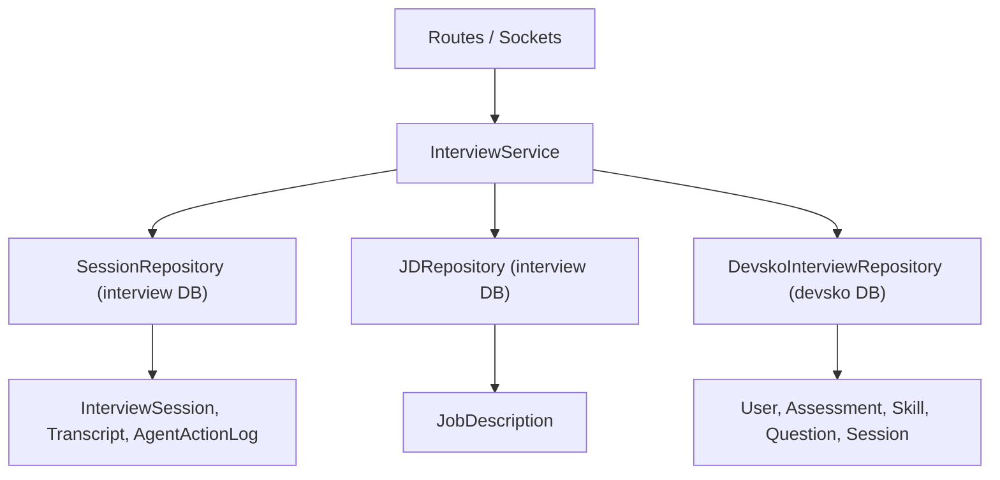

# `app/repositories/` — Data Access Layer

This document covers both repository files:
- `interview_repo.py` — Local interview database repositories
- `devsko_interview_repo.py` — Main Devsko platform repository

---

# `interview_repo.py` — Local DB Repositories

**Location:** `backend/app/repositories/interview_repo.py`  
**Lines:** 93  
**Purpose:** Provides data access classes for the local `interview` database. Follows the Repository pattern — all SQL queries are encapsulated here, keeping service/route code clean.

---

## Classes & Methods

### `BaseRepository` (Lines 4–6)
Abstract base class that stores the database session.

```python
class BaseRepository:
    def __init__(self, db: Session):
        self.db = db
```

### `JDRepository` (Lines 8–24)

| Method | Purpose |
|--------|---------|
| `create(raw_text, candidate_name, ...)` | Creates a `JobDescription` record with all enrichment fields. Commits immediately and returns the refreshed object. |
| `get_by_id(jd_id)` | Simple query by primary key. |

### `SessionRepository` (Lines 26–93)

| Method | Lines | Purpose |
|--------|-------|---------|
| `create(candidate_name, slug, ...)` | 27–42 | Creates an `InterviewSession` with all context fields. |
| `update_status(session_id, status, ...)` | 44–54 | Updates session status and any additional fields via `**kwargs`. Uses `setattr` for dynamic field updates. |
| `get_by_slug(slug)` | 56–63 | Finds session by `share_url_slug` OR `id` using SQLAlchemy's `or_()`. |
| `save_transcript(session_id, role, content, ...)` | 65–74 | Creates a `Transcript` record. Called for every AI question and user answer. |
| `get_transcripts(session_id)` | 76–77 | Returns all transcripts for a session, ordered by timestamp. |
| `save_agent_action(session_id, ...)` | 79–89 | Creates an `AgentActionLog` record. |
| `get_agent_actions(session_id)` | 91–92 | Returns all agent action logs for a session, ordered by timestamp. |

---

# `devsko_interview_repo.py` — Devsko DB Repository

**Location:** `backend/app/repositories/devsko_interview_repo.py`  
**Lines:** 298  
**Purpose:** Provides data access for the main Devsko platform database. Handles complex queries across the assessment hierarchy (groups → steps → versions → sections → skills → questions).

---

## Class: `DevskoInterviewRepository`

### Session Lookups

| Method | Lines | Purpose |
|--------|-------|---------|
| `get_session(session_id)` | 30–35 | Finds `UserAssessmentSession` by UUID. |
| `get_session_by_reference(reference)` | 37–48 | Validates UUID format before querying; returns `None` for invalid UUIDs. |
| `get_session_by_group_uuid_and_user(group_uuid, user_id)` | 50–63 | Finds the latest session for a user in a specific assessment group. Used during session creation. |

### Skill Extraction (Critical Path)

#### `get_assessment_skills(assessment_id)` — Lines 65–115

**This is a key function.** Extracts all skills linked to an assessment through the hierarchy:

```
Assessment → AssessmentVersion (active) → AssessmentSection → AssessmentSectionSkill → Skill
```

**Logic:**
1. Find the active (`islive`) version of the assessment
2. Fallback to the latest version if no live one exists
3. Join through sections and section-skills to get `Skill` records
4. Categorize by `skilltypeid`:
   - `16001`, `16008` → `soft_skills`
   - Everything else → `must_have_tech`
5. Deduplicate by skill name

#### `get_group_skills(group_uuid)` — Lines 117–145

Aggregates skills across **all assessments** in a group by iterating through `AssessmentGroupStep` and calling `get_assessment_skills()` for each.

### User & Resume Lookups

| Method | Purpose |
|--------|---------|
| `get_user_profile(user_id)` | Joins `User` with `UserInfo` to get full profile. |
| `get_current_resume(user_id)` | Gets the most recent resume by `uploaddate`. |

### Assessment Hierarchy

| Method | Purpose |
|--------|---------|
| `get_assessment_group(id)` | Lookup by numeric ID. |
| `get_assessment(id)` | Lookup by numeric ID. |
| `get_assessment_steps(group_id)` | All steps in a group, ordered by `steporder`. |
| `get_skill_assignments(assessment_id)` | Complex 3-table join (SectionSkill → Section → Version) filtered by active version. |
| `get_skills(skill_ids)` | Batch lookup skills by IDs. |
| `get_questions(question_ids)` | Batch lookup questions by IDs. |
| `build_skill_tree(skill_ids)` | Builds a parent-child tree structure from skills using `parentskillid`. Returns `(tree_dict, skills_by_id)`. |

### Response & Dynamic Questions

| Method | Purpose |
|--------|---------|
| `get_responses(session_id)` | All candidate responses for a session, ordered chronologically. |
| `get_dynamic_questions(response_ids)` | AI-generated follow-up questions linked to responses. |

### State Management

#### `update_session_runtime_state(session_id, **fields)` — Lines 248–272

Updates session fields dynamically. If a field exists as a column on the model, it's set directly via `setattr`. If not, it's stored inside `sessionanalysis` JSONB column as overflow storage.

#### `append_agent_memory(session_id, memory_entry)` — Lines 274–297

Appends a transcript entry to the session's agent memory. The memory is stored either in `agentmemory` column (if it exists) or inside `sessionanalysis.agentmemory` (fallback). Keeps only the last 40 entries to prevent unbounded growth.

---

## Data Flow Diagram


