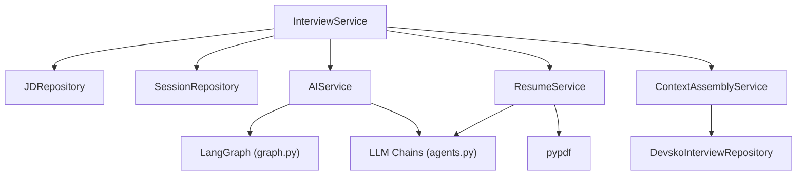

# `app/services/` — Business Logic Layer

This document covers all four service files:
- `interview_service.py` — Main orchestrator
- `ai_service.py` — AI/LLM operations
- `context_service.py` — Context assembly from Devsko DB
- `resume_service.py` — PDF parsing & resume AI

---

# `interview_service.py` — Interview Orchestrator

**Location:** `backend/app/services/interview_service.py`  
**Lines:** 204  
**Purpose:** Central orchestrator that coordinates repositories, AI service, resume service, and context service. All route/socket handlers use this as their primary entry point.

---

## Constructor (Lines 10–15)
```python
class InterviewService:
    def __init__(self, db: Session):
        self.jd_repo = JDRepository(db)
        self.session_repo = SessionRepository(db)
        self.ai_service = AIService()
        self.resume_service = ResumeService()
```
Composes all dependencies: two repos for the local DB, plus AI and resume services.

## Methods

### `get_main_session(session_reference)` — Lines 17–24
Opens a fresh devsko connection, looks up a `UserAssessmentSession` by UUID. Used for status polling.

### `sync_main_session_context(session_id)` — Lines 26–37
Assembles the full context snapshot (`ContextAssemblyService.persist_session_context()`) and persists it to the devsko DB. Called **once** during session creation.

### `append_main_session_memory(session_id, role, content, metadata)` — Lines 39–52
Appends a message to the session's `agentmemory` in the devsko DB. Used by socket handlers for every turn.

### `start_session(candidate_name, jd_text, ...)` — Lines 54–71
Creates a `JobDescription` + `InterviewSession` in the local DB with status `ANALYZING`. Returns the session immediately (fast path for the client).

### `enrich_session_async(session_id, ...)` — Lines 73–145
**Background task** that handles the slow AI work after session creation:
1. Parse resume PDF → extract text
2. Extract skills from JD using AI
3. **Merge** assessment skills with AI-extracted skills (deduplication via `set`)
4. Update session to `READY`
5. Sync context back to main DB

**Merge logic (Lines 97–119):**
```python
merged["must_have_tech"] = list(set(ai_must_have + main_must_have))
merged["nice_to_have_tech"] = list(set(ai_nice_to_have + main_nice_to_have))
merged["soft_skills"] = list(set(ai_soft_skills + main_soft_skills))
```
Assessment skills (from DB) and AI-extracted skills are combined with deduplication.

### `analyze_context(candidate_name, jd_text, ...)` — Lines 147–185
Full holistic analysis: parse resume + run `analyze_full_context()` AI chain + persist to DB. Returns the extracted skills dict. Includes performance timing logs.

### `analyze_context_async(sio, socket_id, ...)` — Lines 187–195
Socket wrapper for `analyze_context()`. Emits `discovery_complete` or `discovery_error` via Socket.IO.

### `process_user_answer(session_slug, user_text)` — Lines 197–203
Saves user answer to transcript. (Additional state/bridge logic is TODO.)

---

# `ai_service.py` — AI/LLM Operations

**Location:** `backend/app/services/ai_service.py`  
**Lines:** 241  
**Purpose:** Manages all interactions with the LangGraph and LLM chains. Handles checkpointing (Postgres or SQLite), graph execution, and state serialization.

---

## Key Methods

### `_serialize_agent_state(values)` — Lines 21–30
Extracts only the client-facing state fields (phase, topic, depth, coverage, guardrails, completion status). Strips internal fields like messages and topic_threads.

### `extract_skills(jd_text)` — Lines 32–36
Async skill extraction from a JD. Calls `get_extraction_chain().ainvoke()`.

### `analyze_full_context(...)` — Lines 38–46
Holistic analysis with all context. Calls `get_full_extraction_chain().ainvoke()`.

### `get_interview_turn(db, transcript, session_state, jd_text)` — Lines 52–112
**The core method.** Executes one turn of the interview graph.

**Logic:**
1. Select checkpointer based on DB type (SQLite vs Postgres)
2. Call `_execute_graph()`
3. On error, return a graceful fallback message

### `_execute_graph(checkpointer, ...)` — Lines 116–185
**The graph execution engine:**

1. Get the current graph state via `app.aget_state(config)`
2. **If no state exists** (first run):
   - Convert transcript to LangChain messages
   - Create full initial `InterviewState`
   - Run graph from scratch: `app.ainvoke(input_state, config)`
3. **If state exists and last message is from user** (subsequent turns):
   - Send just the new `HumanMessage` as an update
   - Graph resumes from checkpointed state: `app.ainvoke(update, config)`
4. **Otherwise** (no new input):
   - Return existing state values
5. Extract the last AI message and serialize the agent state

### `get_current_interview_state(session_id)` — Lines 187–207
Reads the current graph state without executing a turn. Used for status checks and state restoration on reconnection.

### `generate_report(transcript)` — Lines 209–213
Async report generation. Calls `get_report_chain().ainvoke()` with the full transcript JSON.

### `_parse_json(text)` — Lines 215–240
JSON parsing with fallback. Tries regex extraction, ensures required keys exist, logs failures.

---

# `context_service.py` — Context Assembly

**Location:** `backend/app/services/context_service.py`  
**Lines:** 188  
**Purpose:** Assembles a comprehensive context snapshot from the Devsko database, gathering data from 10+ tables into a single JSON structure.

---

## `ContextAssemblyService.build_session_context(session_id)` — Lines 12–170

**The monster query method.** Gathers everything needed for an interview:

1. **Session** → `UserAssessmentSession`
2. **User profile** → `User` + `UserInfo`
3. **Resume** → `UserResume` (latest)
4. **Assessment group** → `AssessmentGroup`
5. **Assessment** → `Assessment`
6. **Steps** → `AssessmentGroupStep` (ordered)
7. **Skill assignments** → 3-way join (SectionSkill → Section → Version)
8. **Skill details** → `Skill` records with parent tree
9. **Questions** → `Question` records
10. **Responses** → `UserAssessmentSessionResponse` records
11. **Dynamic questions** → AI-generated follow-up questions

**Returns** a nested dict with keys: `session`, `user`, `resume`, `job`, `assessment_group`, `assessment`, `skills`, `questions`, `dynamic_questions`, `response_history`

## `persist_session_context(session_id)` — Lines 172–187
Calls `build_session_context()`, then persists the result to the session's `contextsnapshot` JSONB column.

---

# `resume_service.py` — PDF Parsing & Resume AI

**Location:** `backend/app/services/resume_service.py`  
**Lines:** 43  
**Purpose:** Extracts text from PDF resumes and optionally parses them with AI.

## Methods

### `extract_text_from_pdf(file_bytes)` — Lines 8–20
Uses `pypdf.PdfReader` to extract text from all pages. Returns concatenated text string. Catches all exceptions and returns empty string on failure.

### `parse_resume_with_ai(resume_text)` — Lines 22–33
Async method. Calls `get_resume_extraction_chain().ainvoke()` to extract structured data from resume text. Returns parsed JSON.

### `_parse_json(text)` — Lines 35–42
Regex-based JSON extraction from LLM output. Returns `{"raw": text}` if parsing fails.

---

## Service Dependency Diagram


