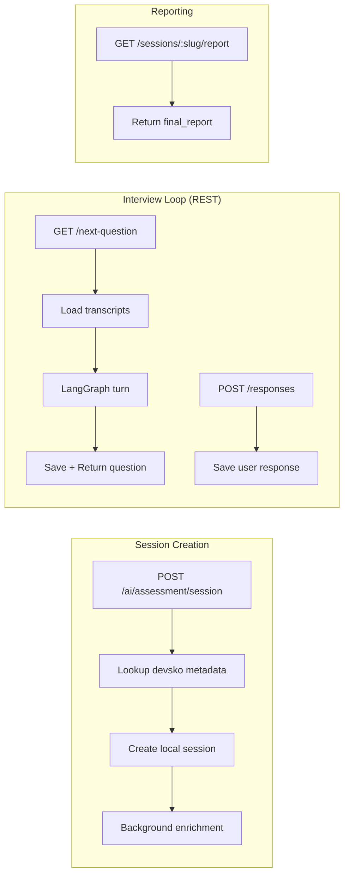

# `app/api/routes/interview.py` — REST API Endpoints

**Location:** `backend/app/api/routes/interview.py`  
**Lines:** 438  
**Purpose:** Defines all HTTP REST endpoints for the interview system. Mounted at both `/api/v2/` and `/api/` (legacy).

---

## Helper Functions

### `success_response(data, code, message)` — Lines 15–21
Standard response wrapper:
```json
{"success": true, "code": 200, "message": "Success", "data": {...}}
```

### `_synthetic_numeric_id(value)` — Lines 24–25
Generates a stable numeric ID from a UUID string using Python's `hash()`. Needed because the Devsko frontend expects numeric session IDs.

### `_get_local_session(db, session_uuid)` — Lines 28–38
Finds a session by UUID or slug using `or_()` filter.

### `_build_question_payload(session, message, sequence)` — Lines 41–63
Builds a question response dict matching the Devsko frontend's expected format, including `questiontypeid`, `responsetypeids`, and `metadata` fields.

---

## Endpoints

### `POST /jds` — Lines 65–69
Creates a job description record. Simple passthrough to `JDRepository.create()`.

### `POST /analyze-context` — Lines 71–105

**Dual-mode analysis endpoint:**

| Mode | Trigger | Behavior |
|------|---------|----------|
| **Async** | `socket_id` provided | Returns `202`, processes in background, emits result via Socket.IO |
| **Sync** | No `socket_id` | Blocks until analysis complete, returns result directly |

**Form fields:** `candidate_name`, `jd_text`, `company_info`, `socket_id`, `resume` (file upload)

### `POST /sessions` — Lines 107–142

Creates a new interview session with background enrichment.

1. Read resume file bytes
2. `service.start_session()` → creates records, returns immediately
3. `background_tasks.add_task(service.enrich_session_async, ...)` → AI analysis in background

**Returns:** `{id, share_url_slug, status: "ANALYZING"}`

### `POST /ai/assessment/session` — Lines 145–268

**The compatibility endpoint for the Devsko frontend.** This is the most complex endpoint.

**Step-by-step flow:**
1. Extract `companyid`, `userid` from payload
2. Open devsko DB connection
3. **Lookup assessment skills** via `get_group_skills()` or `get_assessment_skills()`
4. **Lookup assessment** for JD text (title/description)
5. **Lookup user profile** for candidate name
6. **Lookup user resume** for resume text
7. **Find existing assessment session** by group UUID + user
8. **Sync context** to devsko DB
9. **Create local session** via `service.start_session()`
10. **Trigger background enrichment** with all gathered data

**Returns:** Success response with `userassessmentsessionuuid`, `userassessmentsessionid`, etc.

### `PUT /user/assessment/session` — Lines 271–295
Updates session status. Maps `assessmentstatusid=4` to `READY`, everything else to `COMPLETED`.

### `GET /user/assessment/next-question` — Lines 298–344

**REST polling endpoint for getting the next interview question.**

1. Find the local session
2. Check status (`FAILED` → 500, not `READY` → 420)
3. Load transcripts and build session state
4. Call `ai_service.get_interview_turn()`
5. If interview complete → return `204 No Content`
6. Save AI response to transcript
7. Return question in Devsko format

### `POST /user/assessment/responses` — Lines 347–383

**Saves a candidate's response.**

Extracts the response text from multiple possible fields (`verbal`, `text`, `code`, `query`) and saves to transcript with metadata (`questionid`, `isskipped`, `istimedout`).

### `GET /sessions/{id_or_slug}/status` — Lines 385–412
Returns session status. Tries main devsko DB first, falls back to local DB.

### `GET /main-sessions/{session_reference}/context` — Lines 415–428
Returns the full context snapshot for a main Devsko session.

### `GET /sessions/{slug}/report` — Lines 430–438
Returns the final evaluation report. Returns 404 if not ready.

---

## Endpoint Flow Diagram


