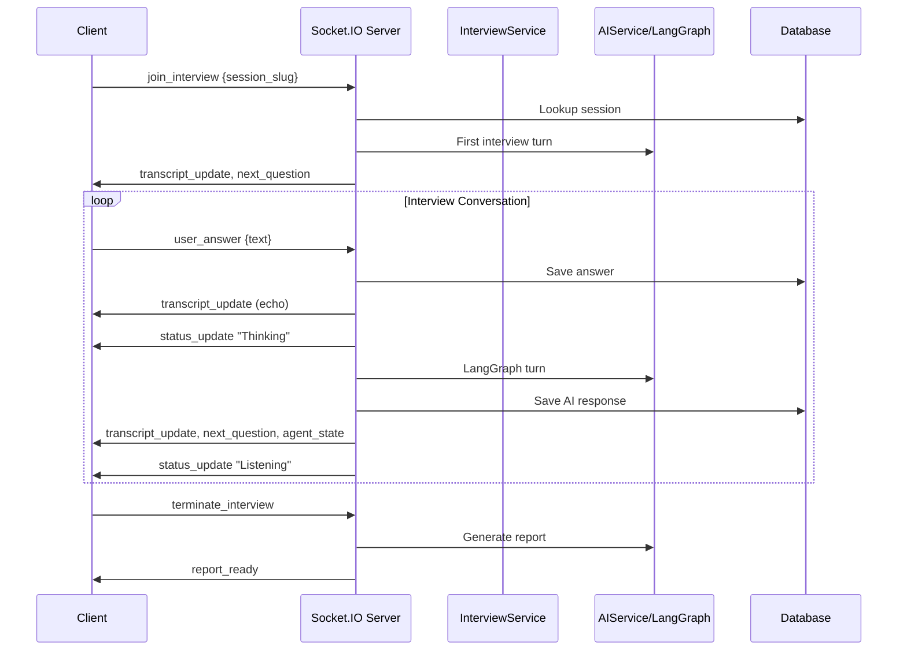

# `app/api/sockets/interview_socket.py` — Socket.IO Event Handlers

**Location:** `backend/app/api/sockets/interview_socket.py`  
**Lines:** 509  
**Purpose:** Handles all real-time WebSocket events for live interview sessions. This is the primary interface for interactive interviews (as opposed to REST polling).

---

## Architecture

---

## Helper Functions

### `_success_response(data, code, message)` — Lines 11–17
Standard response wrapper (same as routes version).

### `_synthetic_numeric_id(value)` — Lines 20–21
Hash-based numeric ID generator.

### `_get_local_session(db, session_reference)` — Lines 24–34
Session lookup by ID or slug.

### `_build_question_payload(session, message, sequence)` — Lines 37–55
Builds question dict in Devsko format.

### `_build_question_payload_for_reference(session_reference, ...)` — Lines 58–82
Variant that works with just a session reference string (no full session object needed).

---

## Event Handlers

All handlers are registered inside `register_socket_handlers(sio)` (Line 85).

### `join_interview(sid, data)` — Lines 112–234

**The entry point for a new interview session.**

**Input:** `{session_slug}` (or `session_id` or `session_token`)

**Dual-path logic:**

#### Path 1: Main Devsko Session (Lines 118–177)
1. Look up `UserAssessmentSession` in devsko DB
2. If **memory exists** (returning user):
   - Replay all transcript entries via `transcript_update`
   - Restore agent state
   - Re-emit the last AI question
3. If **no memory** (new session):
   - Trigger first LangGraph turn with opening phase
   - Save to agent memory
   - Emit opening question

#### Path 2: Local Session (Lines 179–234)
Same logic but using `InterviewSession` and transcripts from local DB.

---

### `user_answer(sid, data)` — Lines 237–373

**Handles each candidate response in the conversation loop.**

**Input:** `{session_slug, text}`

**Dual-path logic (main vs local session):**

1. **Save answer** to DB (transcript or agent memory)
2. **Echo** answer back to client via `transcript_update`
3. **Emit** `status_update: "Thinking"` — UI shows loading indicator
4. **Run LangGraph turn** — analyze answer → decide → generate next question
5. **Save** AI response to DB
6. **Emit** `transcript_update` with AI's question
7. **Emit** `agent_state` with current phase/topic/coverage
8. **Check completion:** If `is_complete`, emit `interview_completed`
9. Otherwise, emit `next_question` with formatted question payload
10. **Emit** `status_update: "Listening"` — UI ready for input
11. **Emit** `phase_transition` if phase changed
12. **Emit** `topic_transition` if topic changed

---

### `request_next_question(sid, data)` — Lines 376–439

**REST-style poll via Socket.IO.** Returns data instead of emitting events.

Same logic as the `GET /next-question` REST endpoint but via Socket.IO callback. Checks session status (FAILED, not READY, etc.) before running the graph.

---

### `discovery_start(sid, data)` — Lines 442–473

**Skill discovery via Socket.IO.**

**Input:** `{candidate_name, jd_text, company_info, resume_text, resume_bytes}`

Runs `service.analyze_context()` and emits `discovery_complete` with extracted skills, or `discovery_error` on failure.

---

### `terminate_interview(sid, data)` — Lines 476–509

**Ends the interview and generates a report.**

**Flow:**
1. Find session
2. Set status to `ANALYZING`
3. Load full transcript
4. Call `ai_service.generate_report()` — Report chain LLM
5. Save report to `final_report` column
6. Set status to `READY`
7. Emit `report_ready` with full report JSON
8. Emit `status_update: "Completed"`

**Error handling:** On failure, sets session status to `FAILED` and emits `error` event.

---

## Socket Events Summary

| Event (Client → Server) | Purpose | Key Emissions |
|--------------------------|---------|---------------|
| `join_interview` | Start/resume interview | `transcript_update`, `next_question`, `agent_state` |
| `user_answer` | Submit candidate response | `transcript_update` (echo), `status_update`, `next_question`, `agent_state`, `phase_transition`, `topic_transition`, `interview_completed` |
| `request_next_question` | Poll for next question | Returns data via callback |
| `discovery_start` | Extract skills from JD | `discovery_complete`, `discovery_error` |
| `terminate_interview` | End interview, get report | `report_ready`, `status_update`, `error` |

| Event (Server → Client) | Purpose |
|--------------------------|---------|
| `transcript_update` | New message in conversation |
| `next_question` | Formatted question payload |
| `agent_state` | Current AI state (phase, topic, etc.) |
| `status_update` | UI status indicator (Thinking/Listening/Finalizing/Completed) |
| `phase_transition` | Phase changed (from → to) |
| `topic_transition` | Topic changed (from → to) |
| `interview_completed` | Interview is done |
| `report_ready` | Final evaluation report |
| `discovery_complete` | Skill extraction results |
| `discovery_error` | Skill extraction failed |
| `error` | General error |
